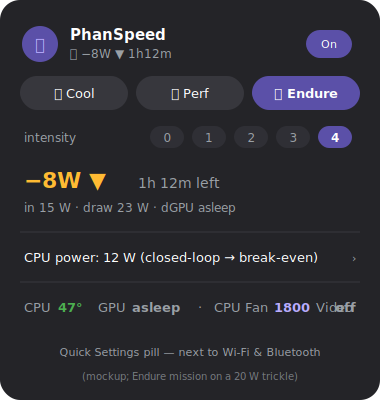

# PhanSpeed

[](https://github.com/asuramaya/phanspeed/actions/workflows/ci.yml)
[](https://github.com/asuramaya/phanspeed/releases/latest)
[](LICENSE)


Dell thermal/fan control for GNOME, living where it belongs — a **Quick
Settings pill** next to Wi-Fi and Bluetooth. Built and tested on a **Precision
5770** (GNOME 50, Wayland); should work on any Dell that exposes
`platform_profile` via `dell-smm-hwmon`.

> **Not affiliated with or endorsed by Dell.** "Dell", "Precision", and "XPS"
> are trademarks of their respective owners. Use at your own risk — see the
> [thermal failsafe](#security-model) and the no-warranty terms in the license.

<p align="center">
  
</p>

<sub>Mockup of the expanded pill. To capture a real recording on Wayland:
`gnome-extensions enable phanspeed@local`, open Quick Settings, then use the
built-in screen recorder (<kbd>Ctrl</kbd>+<kbd>Shift</kbd>+<kbd>Alt</kbd>+<kbd>R</kbd>)
and convert the WebM to GIF (e.g. `ffmpeg -i clip.webm docs/demo.gif`).</sub>

## Why a "thermal" pill and not RPM sliders

Direct fan/RPM control is **firmware-locked** on modern Dells — verified on this
machine: `pwm_enable` accepts only `1` (BIOS-auto), and `pwm` writes are ignored
(`EINVAL`). No Linux tool can set fan RPM here. The one lever the firmware honors
is the ACPI **platform_profile**: `cool · quiet · balanced · performance`.
`cool` makes the EC ramp fans early and hard; `quiet` keeps them calm. PhanSpeed
drives that, with a temperature auto-policy on top (the closest thing to a fan
curve the hardware allows).

## What you get

A Quick Settings pill that:
- Shows the active profile + CPU temp at a glance (icon changes with profile).
- **Click the pill** → toggle *Auto by temperature* on/off.
- **Open the menu** → pick a profile manually (Quiet/Balanced/Cool/Performance),
  set a **CPU power limit** (Intel RAPL PL1 — the real fix for sustained heat) or
  let it **scale power with temperature**, and see live CPU/GPU temps and fan RPM.
- **Quiet on battery** — optionally force a calm profile + low CPU power whenever
  you unplug.
- **Discrete GPU** (NVIDIA, optional) — cap GPU power and see GPU temp / draw /
  utilization in the pill.
- Turns red on the **emergency override** (forced max cooling above 90 °C, which
  also drops the CPU to its base TDP to cut heat at the source).

## Architecture

```
 GNOME Shell extension  (phanspeed@local — the pill, runs as you)
    │  reads  /run/phanspeed/status.json   (0640, owner+root only)
    │  writes /run/phanspeed/control.sock  (owner+root, SO_PEERCRED-gated)
    ▼
 phanspeedd  (systemd daemon, root)  ──writes──▶  platform_profile
```

The root daemon is the only thing that writes the profile and runs the auto
policy + emergency failsafe. The pill never needs root and never needs a special
group — it reads the status file and pokes the control socket as you.

## Security model

The daemon is root and accepts IPC, so it's locked down hard. Threat model: an
**unprivileged local process** trying to abuse the root daemon (no network
surface — it binds only an `AF_UNIX` socket).

- **Authorization** — every connection is authenticated by **SO_PEERCRED**; only
  root and the UIDs in `allow_uids` (the installer sets this to *you*) may issue
  commands. The socket is also chowned to you + mode `0660`, so others can't even
  connect.
- **Input is hostile by default** — all socket and config-file fields are
  type-checked and clamped. `emergency_temp` is **hard-capped at 95 °C**, so the
  thermal failsafe can never be disabled, and the invariants
  `clear < emergency` and `cool > quiet` are always enforced — on socket sets
  *and* on config load (a tampered config can't weaken safety).
- **DoS-resistant** — 64 KB read cap, per-command rate limiting, `/etc` written
  only on real change.
- **Sandboxed unit** — zero capabilities, `ProtectSystem=strict`, read-only FS
  except `/etc/phanspeed`, `IPAddressDeny=any`, `RestrictAddressFamilies=AF_UNIX`,
  `SystemCallFilter=@system-service`, `MemoryDenyWriteExecute`, `ProtectProc`,
  private tmp/devices/keyring. (`ProtectKernelTunables` is intentionally off — it
  would block the `/sys` profile write.)
- **Least disclosure** — `status.json` is `0640` owner+root, not world-readable.

Adversarial tests live in `tests/attack_socket.py` (fuzzes the handler + socket,
asserts the failsafe invariants always hold). Run: `python3 tests/attack_socket.py`.

## Install

**Option A — `.deb` (recommended; gets auto-updates):**

```bash
sudo apt install ./phanspeed_*.deb        # from a GitHub release, or `make deb`
gnome-extensions enable phanspeed@local   # then log out/in once (Wayland)
```

The package installs the daemon, healthcheck, auto-tuner, the system-wide
extension, and an **auto-update** timer (`phanspeed-update.timer`, daily) that
pulls newer releases from GitHub and installs them — verifying the download's
SHA256 against the release's `SHA256SUMS`. Disable it any time with
`sudo systemctl disable --now phanspeed-update.timer`. (HTTPS + checksum is
transport/corruption integrity, not a GPG signature — signing is planned.)

**Option B — one-line install (fetches the latest release):**

```bash
curl -fsSL https://raw.githubusercontent.com/asuramaya/phanspeed/main/install.sh | bash
```

**Option C — from a clone:**

```bash
cd phanspeed
./install.sh          # sudo: daemon + service, then extension into your home
```

Either way, **log out and back in once** — Wayland has to restart the shell to
load a brand-new extension. After that the pill is there permanently; no more
logouts. (Auto-update is a `.deb`-only feature; source installs update via
`git pull && ./install.sh`.)

## Files

```
bin/phanspeedd                     root daemon (profile control, auto, failsafe)
extension/phanspeed@local/         GNOME Shell Quick Settings extension
systemd/phanspeed.service          starts the daemon at boot
diag.py                            one-shot hardware probe (proves RPM is locked)
install.sh / uninstall.sh
```

## Command line

One `phanspeed <verb>` entrypoint drives everything from a terminal:

```bash
phanspeed status [--json]                      # profile, temp, power, EPP, battery
phanspeed profile <quiet|balanced|cool|performance|auto>
phanspeed power <WATTS|auto|full>              # CPU RAPL cap
phanspeed epp <performance|…|power|auto>       # HWP energy preference
phanspeed tune [--target both --apply]         # auto-tuner (needs sudo)
phanspeed update [--check]                      # pull a newer release (.deb installs)
phanspeed version
```

## Service commands

```bash
systemctl status phanspeed           # daemon health
journalctl -u phanspeed -f           # live log (profile changes, emergencies)
cat /run/phanspeed/status.json       # what the pill sees
cat /sys/firmware/acpi/platform_profile   # active profile right now
gnome-extensions info phanspeed@local     # extension state
sudo phanspeedd --selftest                # verify controllable hardware
systemctl status phanspeed-healthcheck.timer   # auto-restart watchdog
./uninstall.sh
```

A `phanspeed-healthcheck.timer` runs every ~2 min and restarts the daemon if it
ever goes inactive or its status snapshot goes stale.

## Tuning

Edit `/etc/phanspeed/config.json` (then `sudo systemctl restart phanspeed`):

| key | meaning |
|-----|---------|
| `quiet_below` | below this °C → Quiet |
| `cool_above`  | above this °C → Cool (between → Balanced) |
| `hysteresis`  | °C deadband so it doesn't flap |
| `emergency_temp` | force max cooling at/above this °C |
| `power_limit_w` | CPU sustained power cap (Intel RAPL PL1) in W; `0` = unmanaged |
| `power_auto` | scale the power cap with temperature (cool→full, warm→base TDP, hot→floor) |
| `power_floor_w` | the cap when hot under `power_auto`; `0` = base TDP |
| `battery_aware` | on battery, force `battery_profile` + cap CPU to base TDP |
| `battery_profile` | profile to use while on battery (default `quiet`) |
| `battery_power_w` | tuned CPU cap to use on battery (set by `phanspeed-tune`); `0` = base TDP |
| `turbo` | `auto` (leave alone) · `on` · `off` — force CPU turbo/boost; emergency/battery force it off |
| `epp` | HWP energy/perf preference on AC (`performance`…`power`); `""` = leave alone |
| `battery_epp` | EPP to use on battery; `""` = `balance_power` fallback |
| `gpu_power_limit_w` | NVIDIA GPU power cap in W (via `nvidia-smi`); `0` = default |
| `gpu_persistence` | enable `nvidia-smi -pm 1` (mainly for desktops; off by default) |

Under `power_auto` the CPU cap ramps **smoothly** from the firmware default at
`quiet_below` down to the floor at `cool_above`.

### Auto-tuning (`phanspeed-tune`)

Instead of guessing power caps, let the machine find them. `phanspeed-tune` runs a
closed-loop sweep: it drives the RAPL cap under a controlled all-core load,
measures steady-state temperature, package power and clock at each step, and
derives two operating points — the **performance knee** (AC: the lowest cap that
still reaches the best clock under a thermal ceiling — same speed, least heat) and
the **best MHz-per-watt knee** (battery). With `--apply` it writes a complete **scene** for each state — power cap
*plus* a matching EPP (`performance` on AC, `balance_power` on battery) — into the
config (`power_limit_w`/`epp` and `battery_power_w`/`battery_epp`), so the daemon
applies the right whole bundle per plug-state. On a voltage-locked machine (no
undervolting), capping power at the efficiency knee + the right EPP is the closest
equivalent to undervolting you can get.

```bash
sudo phanspeed-tune --dry-run                 # show the plan, no stress
sudo phanspeed-tune --target both --apply     # full sweep, write results
sudo phanspeed-tune --ceiling 80 --step 5     # gentler ceiling, finer steps
```

The phanspeed daemon keeps running during a sweep (its emergency failsafe stays
armed); the tuner just tells it to stop managing CPU power for the duration. RAPL
can only make the chip slower — never wrong — so this is safe and needs no
stability gate. Full design, including the (gated) undervolt auto-tuner and its
self-checking + boot-watchdog safety model: [docs/AUTOTUNE.md](docs/AUTOTUNE.md).

The 5770 runs hot. `platform_profile` only changes *fan* behaviour — to actually
cut the heat, cap CPU power: set `power_limit_w` (e.g. the chip's base TDP) or use
the **CPU power limit** submenu in the pill. On 12th-gen+ Intel, RAPL is the lever
that works (MSR undervolting is locked by the Plundervolt mitigation). The
emergency override also drops to base TDP automatically.

## Compatibility

| Requirement | Notes |
|-------------|-------|
| GNOME Shell | 46–50 (Quick Settings extension API) |
| `platform_profile` | must exist: `cat /sys/firmware/acpi/platform_profile_choices` |
| `dell-smm-hwmon` | for temp/fan readout (loaded by default on Dell) |
| Python | 3.x stdlib only (no pip deps) |

Confirmed: **Dell Precision 5770**. Other Dells with `platform_profile` should
work — please file a [hardware report](.github/ISSUE_TEMPLATE/hardware_report.md)
with your model and `diag.py` output.

> Direct fan **RPM/PWM** control is impossible on locked-down Dell firmware
> (the EC rejects it). Run `sudo python3 diag.py` to see what your machine
> allows; `platform_profile` is the lever PhanSpeed uses.

## Project

- [Architecture](docs/ARCHITECTURE.md) · [Contributing](CONTRIBUTING.md) ·
  [Code of Conduct](CODE_OF_CONDUCT.md) · [Security policy](SECURITY.md) ·
  [Changelog](CHANGELOG.md) · [Auto-tuner design](docs/AUTOTUNE.md)
- Common tasks: `make help` (install, lint, test, pack, check)
- Adversarial test suite: `make test` (`python3 tests/attack_socket.py`)
- License: [GPL-3.0-or-later](LICENSE)

