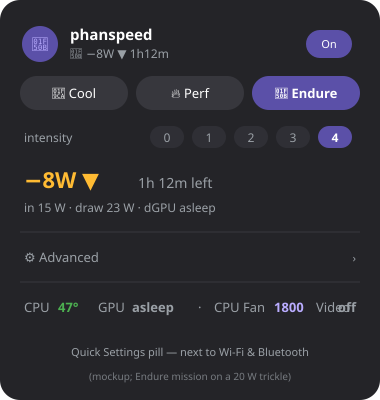

# PhanSpeed

[](https://github.com/asuramaya/phanspeed/actions/workflows/ci.yml)
[](https://github.com/asuramaya/phanspeed/releases/latest)
[](LICENSE)


Dell thermal/fan control for GNOME, living where it belongs — a **Quick
Settings pill** next to Wi-Fi and Bluetooth. Built and tested on a **Precision
5770** (GNOME 50, Wayland); should work on any Dell that exposes
`platform_profile` via `dell-smm-hwmon`.

> **Not affiliated with or endorsed by Dell.** "Dell", "Precision", and "XPS"
> are trademarks of their respective owners. Use at your own risk — see the
> [thermal failsafe](#security-model) and the no-warranty terms in the license.

<p align="center">
  
</p>

<sub>Mockup of the expanded pill. To capture a real recording on Wayland:
`gnome-extensions enable phanspeed@asuramaya`, open Quick Settings, then use the
built-in screen recorder (<kbd>Ctrl</kbd>+<kbd>Shift</kbd>+<kbd>Alt</kbd>+<kbd>R</kbd>)
and convert the WebM to GIF (e.g. `ffmpeg -i clip.webm docs/demo.gif`).</sub>

## Why a "thermal" pill and not RPM sliders

Direct fan/RPM control is **firmware-locked** on modern Dells — verified on this
machine: `pwm_enable` accepts only `1` (BIOS-auto), and `pwm` writes are ignored
(`EINVAL`). No Linux tool can set fan RPM here. The one lever the firmware honors
is the ACPI **platform_profile**: `cool · quiet · balanced · performance`.
`cool` makes the EC ramp fans early and hard; `quiet` keeps them calm. PhanSpeed
drives that, with a temperature auto-policy on top (the closest thing to a fan
curve the hardware allows).

## Two missions (+ one that still works, just not on the pill)

PhanSpeed is one governor fighting the things that cripple a laptop — you pick
which fight it's in, and the pill re-skins to that mission's metric:

- 🔥 **Perf** — *unleash*: take everything the chassis allows, including the
  most aggressive cooling profile. (Born from fixed fans.)
- 🔋 **Endure** — *survive power*: minimise draw to **live on a power trickle** —
  closed-loop CPU cap to **break-even**, dGPU sleep, panel/kbd trims, with a live
  `+2W ▲ / −8W ▼` balance gauge. (Born from a 20 W charger.)

🧊 **Cool** (*survive heat*, born from a dead fan that's since been repaired)
is still a fully working mission — `phanspeed mission cool` — it's just not a
pill chip: Perf's own cooling-profile pick already covers the same ground
mechanically (its max-cooling choice *is* the `cool` ACPI profile), so a third
chip was a distinction without a difference.

`phanspeed survive` / `phanspeed mission <perf|endure|cool>` + `phanspeed
intensity <0-4>`, or the mission chips in the pill. Full design:
[docs/MISSIONS.md](docs/MISSIONS.md).

## What you get

A Quick Settings pill that:
- Shows a **mission chip row** (🔥 Perf · 🔋 Endure) and an **intensity dial**,
  re-skinning its headline to that mission's own metric (clock-watts / break-even).
- Puts every other knob (profile, CPU power, turbo, EPP) under one **⚙ Advanced**
  expander, editable in manual mode and shown read-only while a mission owns the
  stance.
- Turns red on the **emergency override** (forced max cooling above 90 °C, which
  also drops the CPU to its base TDP to cut heat at the source).
- Notifies you in place, with a one-click **⬆ Update to vX.Y.Z** item, when a
  newer signed release is out; the daily background check never installs
  unattended.

Full day-to-day interaction, every mode and menu: [docs/USAGE.md](docs/USAGE.md).

There's deliberately no GPU power/temp widget: `nvidia-smi -pl` is firmware-locked
on this class of hardware anyway, and polling the dGPU to show live numbers keeps
it awake — which can starve the CPU's power budget under AC (see
[docs/ARCHITECTURE.md](docs/ARCHITECTURE.md) for the BD PROCHOT finding). The
Endure mission still puts the dGPU to sleep when idle; it just doesn't poll it
for a widget.

A GNOME Shell extension (the pill, runs as you) reads a status file and pokes a
control socket; a root systemd daemon owns every privileged write and the
emergency failsafe. Full component and control-loop breakdown:
[docs/ARCHITECTURE.md](docs/ARCHITECTURE.md).

## Security model

The daemon is root and accepts local IPC, so it's locked down hard: SO_PEERCRED
authorization, a hard-capped 95 °C failsafe that can't be disabled from the
socket or a tampered config, and a heavily sandboxed systemd unit (one
capability, no network, seccomp-filtered). Full breakdown in
[docs/ARCHITECTURE.md](docs/ARCHITECTURE.md#security-model-see-also-securitymd);
vulnerability reporting in [SECURITY.md](SECURITY.md).

## Install

**Option A — `.deb` (recommended; gets update notices):**

```bash
sudo apt install ./phanspeed_*.deb        # from a GitHub release, or `make deb`
gnome-extensions enable phanspeed@asuramaya   # then log out/in once (Wayland)
```

The package installs the daemon, healthcheck, auto-tuner, the system-wide
extension, and a daily **update-check** timer (`phanspeed-update.timer`) that
looks for newer GitHub releases and surfaces an **⬆ Update to vX.Y.Z** notice in
the pill — it never installs anything unattended. Installing is a deliberate,
interactive step: click the pill's update item (a `pkexec` prompt) or run `sudo
phanspeed update` yourself. Either way the download is verified against the
release's `SHA256SUMS` and, once the release is sealed, a detached SSH
signature (`SHA256SUMS.sig`) from a FIDO2 hardware key pinned outside GitHub's
control; the install is refused (fails closed) on any mismatch or missing
signature. Disable the check timer any time with `sudo systemctl disable --now
phanspeed-update.timer`.

**Option B — one-line install (fetches the latest release):**

```bash
curl -fsSL https://raw.githubusercontent.com/asuramaya/phanspeed/main/install.sh | bash
```

**Option C — from a clone:**

```bash
cd phanspeed
./install.sh          # sudo: daemon + service, then extension into your home
```

Either way, **log out and back in once** — Wayland has to restart the shell to
load a brand-new extension. After that the pill is there permanently; no more
logouts. (The update-check timer is a `.deb`-only feature; source installs
update via `git pull && ./install.sh`.)

## Compatibility

| Requirement | Notes |
|-------------|-------|
| GNOME Shell | 46-50 (Quick Settings extension API) |
| `platform_profile` | must exist: `cat /sys/firmware/acpi/platform_profile_choices` |
| `dell-smm-hwmon` | for temp/fan readout (loaded by default on Dell) |
| Python | 3.x stdlib only (no pip deps) |
| `openssh-client` | `ssh-keygen`, for release-signature verification (see [packages.txt](packages.txt)) |

Confirmed: **Dell Precision 5770**. Other Dells with `platform_profile` should
work; if yours doesn't behave, or you'd like to confirm a new model, see
[docs/USAGE.md](docs/USAGE.md#troubleshooting).

## Learn more

| | |
|---|---|
| Use it day to day | [docs/USAGE.md](docs/USAGE.md) |
| Understand how it's built | [docs/ARCHITECTURE.md](docs/ARCHITECTURE.md) |
| Cut a release | [docs/RELEASING.md](docs/RELEASING.md) |
| See what changed | [CHANGELOG.md](CHANGELOG.md) |
| Contribute | [CONTRIBUTING.md](CONTRIBUTING.md) |
| Report a vulnerability | [SECURITY.md](SECURITY.md) |

License: [GPL-3.0-or-later](LICENSE).

